# UC Intramurals Management System

A comprehensive web-based system for managing intramural activities, athlete profiles, events, schedules, and approvals at the University of Cebu.

## System Overview

The UC Intramurals System is a PHP-based web application that manages:
- User registration and authentication
- Department management
- Event creation and management
- Athlete profile management
- Multi-level approval system (Coach → Dean → Admin)
- Schedule management
- Search and reporting

## Technology Stack

- **Backend**: PHP
- **Database**: MySQL/SQLite (configurable)
- **Frontend**: HTML, CSS (W3Schools-inspired design)
- **Framework**: W3.CSS

## User Roles

1. **Admin** - Full system access
2. **Tournament Manager** - Event management
3. **Coach** - Athlete approval and profile management
4. **Dean** - Athlete approval, search, and reporting
5. **Athlete** - Profile creation and submission

## System Flow

### Registration and Login Flow


### Athlete Profile Submission and Approval Flow


### Event Management Flow


### Module Access Flow

```mermaid
flowchart TB
    Start([User Logs In]) --> CheckRole{Check User Role}
    
    CheckRole -->|Admin| AdminDash[🔑 ADMIN DASHBOARD]
    CheckRole -->|Tournament Manager| TMDash[📋 TOURNAMENT MANAGER DASHBOARD]
    CheckRole -->|Coach| CoachDash[👨‍🏫 COACH DASHBOARD]
    CheckRole -->|Dean| DeanDash[🎓 DEAN DASHBOARD]
    CheckRole -->|Athlete| AthleteDash[🏃 ATHLETE DASHBOARD]
    
    %% Admin Modules
    AdminDash --> AdminMod1[📁 Department Management<br/>Create/Update/Delete Departments]
    AdminDash --> AdminMod2[🎯 Event Management<br/>Create/Update/Delete All Events]
    AdminDash --> AdminMod3[📅 Schedule Management<br/>Create/Update/Delete Schedules]
    AdminDash --> AdminMod4[✅ Athlete Approval<br/>Approve/Disapprove Athletes]
    AdminDash --> AdminMod5[📊 Reports<br/>View Participants per Event per College]
    AdminDash --> AdminMod6[👥 Register Users<br/>Register All User Types]
    
    %% Tournament Manager Modules
    TMDash --> TMMod1[🎯 Event Management<br/>Create/Update/Delete Own Events]
    TMDash --> TMMod2[👤 My Profile<br/>View/Update Profile Info]
    
    %% Coach Modules
    CoachDash --> CoachMod1[✅ Athlete Approval<br/>Approve/Disapprove Assigned Athletes]
    CoachDash --> CoachMod2[👤 My Profile<br/>View/Update Profile Info]
    
    %% Dean Modules
    DeanDash --> DeanMod1[✅ Athlete Approval<br/>Approve/Disapprove Department Athletes]
    DeanDash --> DeanMod2[🔍 Search & Report<br/>Search Athletes/Coaches in Department]
    DeanDash --> DeanMod3[👤 My Profile<br/>View/Update Profile Info]
    
    %% Athlete Modules
    AthleteDash --> AthleteMod1[📝 My Profile<br/>Fill Up & Submit Athlete Profile]
    
    %% Styling
    classDef adminStyle fill:#2196F3,stroke:#1976D2,stroke-width:3px,color:#fff
    classDef tmStyle fill:#4CAF50,stroke:#45a049,stroke-width:3px,color:#fff
    classDef coachStyle fill:#FF9800,stroke:#e68900,stroke-width:3px,color:#fff
    classDef deanStyle fill:#9C27B0,stroke:#7b1fa2,stroke-width:3px,color:#fff
    classDef athleteStyle fill:#F44336,stroke:#da190b,stroke-width:3px,color:#fff
    classDef moduleStyle fill:#f5f5f5,stroke:#333,stroke-width:2px
    
    class AdminDash adminStyle
    class TMDash tmStyle
    class CoachDash coachStyle
    class DeanDash deanStyle
    class AthleteDash athleteStyle
    class AdminMod1,AdminMod2,AdminMod3,AdminMod4,AdminMod5,AdminMod6,TMMod1,TMMod2,CoachMod1,CoachMod2,DeanMod1,DeanMod2,DeanMod3,AthleteMod1 moduleStyle
```



### Module Access Summary Table

| Role | Available Modules | Access Level |
|------|------------------|--------------|
| **Admin** | Department Management | Full CRUD |
| | Event Management | Full CRUD (All Events) |
| | Schedule Management | Full CRUD |
| | Athlete Approval | Approve/Disapprove All |
| | Reports | View All Reports |
| | Register Users | Register All Roles |
| **Tournament Manager** | Event Management | CRUD (Own Events Only) |
| | My Profile | View/Update |
| **Coach** | Athlete Approval | Approve/Disapprove (Assigned Athletes) |
| | My Profile | View/Update |
| **Dean** | Athlete Approval | Approve/Disapprove (Department Athletes) |
| | Search & Report | Search Department Athletes/Coaches |
| | My Profile | View/Update |
| **Athlete** | My Profile | Create/Update/Submit |

## Database Schema

### Core Tables


## Module Breakdown

### 1. Registration Module (Weight: 2)
- **Access**: All users
- **Features**:
  - User registration with role selection
  - Role-based profile data collection
  - Login authentication
  - Session management

### 2. Department Management Module (Weight: 1)
- **Access**: Admin only
- **Features**:
  - Create departments
  - Update departments
  - Delete departments
  - View department list

### 3. Tournament Manager Module (Weight: 1)
- **Access**: Admin (create), Tournament Manager (view/update profile)
- **Features**:
  - Admin creates Tournament Manager accounts
  - Tournament Managers can view/update their profile

### 4. Event Module (Weight: 4)
- **Access**: Admin (all events), Tournament Manager (own events)
- **Features**:
  - Create events
  - Update events
  - Delete events
  - View events in table format
  - Admin can assign Tournament Managers

### 5. Coach Management Module (Weight: 1)
- **Access**: Coach
- **Features**:
  - Coaches can create/update their profile information

### 6. Dean Management Module (Weight: 1)
- **Access**: Dean
- **Features**:
  - Deans can create/update their profile information

### 7. Athlete Profile Management Module (Weight: 4)
- **Access**: Athlete (submit), Coach/Dean/Admin (approve)
- **Features**:
  - Athletes fill up and submit profile
  - Coach approves/disapproves
  - Dean approves/disapproves
  - Admin approves/disapproves
  - Approval log tracking
  - Status display (pending/approved/disapproved)

### 8. Schedule Management Module (Weight: 3)
- **Access**: Admin only
- **Features**:
  - Create schedule
  - Update schedule
  - Delete schedule
  - Display schedule with event details

### 9. Search and Report Module (Weight: 3)
- **Access**: Dean (search), Admin (reports)
- **Features**:
  - Dean searches athletes/coaches in their college
  - Dean views report of athletes & coaches with events
  - Admin views total participants per event per college

## File Structure

```
UC_Intramurals/
├── config/
│   ├── database.php          # Database configuration and table creation
│   └── database/             # SQLite database directory
├── css/
│   └── style.css             # W3Schools-inspired styling
├── index.php                 # Main dashboard
├── login.php                 # Login page
├── register.php              # Registration page
├── logout.php                # Logout handler
├── department.php            # Department management (Admin)
├── event.php                 # Event management (Admin/TM)
├── schedule.php              # Schedule management (Admin)
├── athlete_profile.php       # Athlete profile form
├── athlete_approve.php       # Approval system (Coach/Dean/Admin)
├── coach_profile.php         # Coach profile management
├── dean_profile.php          # Dean profile management
├── tournament_manager_profile.php  # TM profile management
├── search.php                # Search & Report (Dean)
├── report.php                # Admin reports
└── README.md                 # This file
```

## Installation

1. **Requirements**:
   - XAMPP (PHP 7.4+ and MySQL)
   - Web browser

2. **Setup**:
   ```bash
   # Place files in XAMPP htdocs directory
   C:\xampp\htdocs\UC_Intramurals\
   ```

3. **Database Configuration**:
   - Edit `config/database.php`
   - Set `DB_TYPE` to 'mysql' or 'sqlite'
   - For MySQL, configure:
     - DB_HOST: localhost
     - DB_NAME: uc_intramurals
     - DB_USER: root
     - DB_PASS: (empty for XAMPP default)

4. **Access**:
   - Open browser: `http://localhost/UC_Intramurals/`
   - Database tables are created automatically on first access

## Usage Flow

### For Administrators:
1. Register/Login as Admin
2. Create departments
3. Register users (Tournament Managers, Coaches, Deans, Athletes)
4. Manage events (create, update, delete)
5. Create schedules
6. Approve athlete profiles
7. View reports

### For Tournament Managers:
1. Register/Login as Tournament Manager
2. Create and manage events
3. Update profile information

### For Coaches:
1. Register/Login as Coach
2. Update profile information
3. Approve/disapprove athlete profiles

### For Deans:
1. Register/Login as Dean
2. Update profile information
3. Approve/disapprove athlete profiles
4. Search athletes/coaches in their department
5. View department reports

### For Athletes:
1. Register/Login as Athlete
2. Fill up and submit athlete profile
3. Wait for approval from Coach → Dean → Admin

## Approval Workflow


## Features

- ✅ Multi-role authentication system
- ✅ Role-based access control
- ✅ Approval workflow with logging
- ✅ Responsive design
- ✅ Modern UI with W3Schools-inspired styling
- ✅ Database abstraction (MySQL/SQLite)
- ✅ Automatic table creation
- ✅ Search and reporting capabilities
- ✅ Event and schedule management

## Security Features

- Password hashing (bcrypt)
- Session management
- SQL injection prevention (PDO prepared statements)
- XSS protection (htmlspecialchars)
- Role-based access control

## Notes

- Approval status columns are backend logic (not in initial schema)
- Approval log tracks all approval actions with timestamps
- Each role can only see relevant data (Coach sees their athletes, Dean sees their department)
- Admin has full system access

## Support

For issues or questions, refer to the code comments or contact the development team.

---

**Version**: 1.0  
**Last Updated**: 2024

